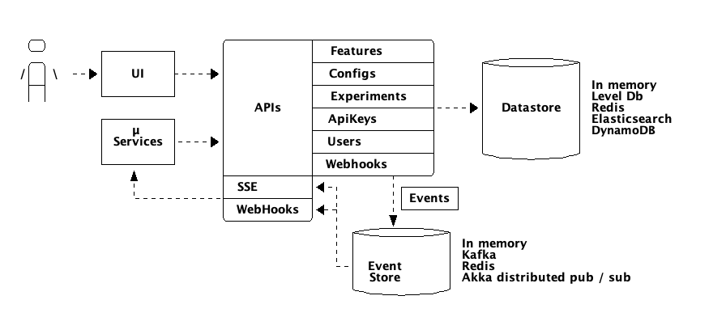

# Architecture

As said before, Izanami provide different features : 

* API first 
* Multi data store (In Memeory, Level DB, redis, cassandra, elasticsearch) 
* Listenable events (SSE, webhooks)
* Multi event store (In Memory, Redis, Kafka, Akka distributed pub / sub)
 
 

The data of each domains (features, configs, experiments ...) are compartmentalized in buckets. 
Izanami can be plugged with 2 or more databases at the same time where each database store on or more bucket. 

Izanami contains the following buckets : 

* features: to store features 
* configs: to store configs
* experiments: to store A / B testing experiments
* variant binding: to store the association between a user and an experiment's variant 
* experiment events: to store the event about an experiment (displayed, won)
* global scripts: to store script used by features 
* api keys: to store api keys 
* web hooks: to store registered webhook
* users: to store users 

You can see how to configure buckets on the @ref[settings](../configuration/settings.md) page. 
 
